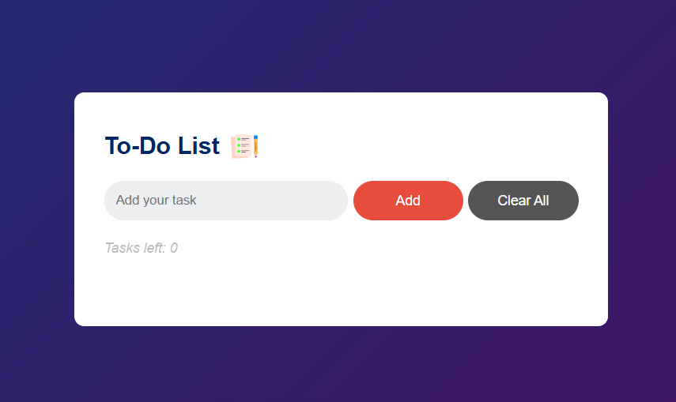
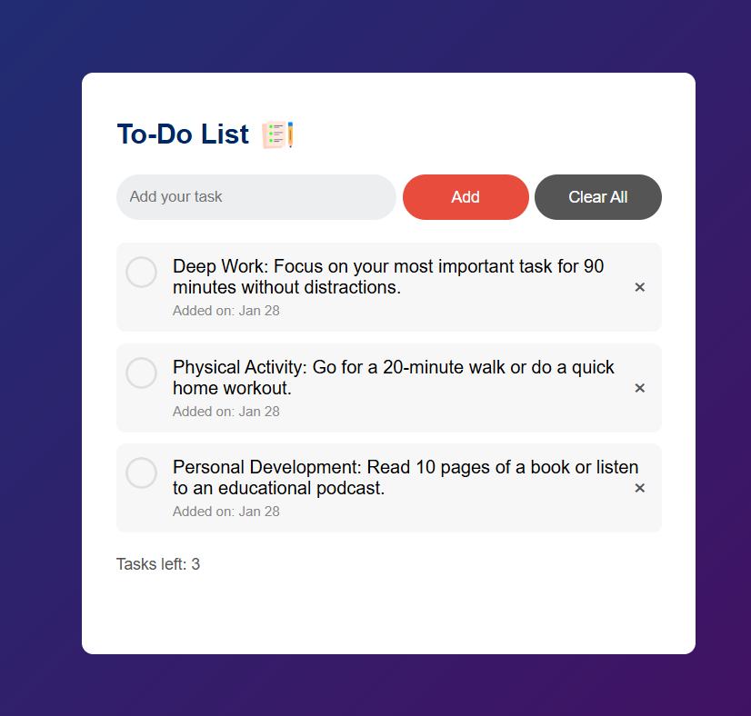

# 📝 To-Do List App

A simple and interactive To-Do List application that allows users to add, complete, and delete tasks, with real-time task counter and local storage support.

---

## 📌 Project Idea
The To-Do List App allows users to:
- Add new tasks
- Mark tasks as completed
- Delete individual tasks
- Clear all tasks at once
- See remaining tasks counter
- Persist tasks in browser using Local Storage

---

## 🛠️ Technologies Used
- HTML5
- CSS3
- JavaScript (ES6)

---

## 🖼️ Screenshots
Here are some screenshots of the app in action:

---

## 🚀 Features
- Add, complete, and delete tasks
- Clear all tasks
- Real-time counter for tasks left
- Local Storage to save tasks
- Responsive and clean UI

---

## 📂 Project Structure
ToDo-App/
│── images/
│   ├── screenshot.png
│   ├── screenshot(2).png
│   ├── icon.png
│   ├── checked.png
│   └── unchecked.png
│── index.html
│── style.css
│── script.js
│── README.md

---

## 👩‍💻 Author
**Basma Ayash**  
GitHub: https://github.com/Basmaayash

